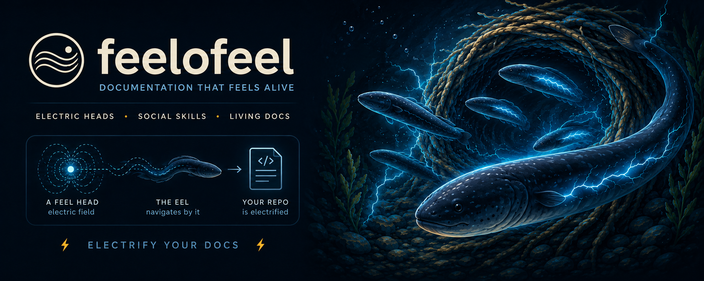

# FEEL — Documentation Operating System



FEEL is a lightweight, copy-on-adopt framework for keeping project documentation easy for humans and AI agents to navigate. It adds structured YAML heads, one canonical documentation map, explicit relations between documents, and small maintenance routines—without adding an application runtime or hosted service.

**FEEL** stands for **F**rontmatter first · **E**xplicit two-way relations · **E**volve with proportional ceremony · **L**ight by default.

## Current state

| Item | Status |
|---|---|
| Framework specification | `feel_version: "1.6"` |
| Distribution | Copy from this repository; the npm package is not published yet |
| Package metadata | `0.2.0`, an internal pre-publish version independent of the framework version |
| Runtime requirements | Node.js 18+ for the installer and validation tools; Git is optional |
| Agent support | Plain Markdown/YAML works with any file-reading agent; slash commands are packaged for Claude Code |
| Proven scale | Used in a roughly 25-document, single-operator, single-agent project; larger-team guidance is designed but not yet validated |

FEEL 1.6 currently includes:

- a variable-length YAML head format for document identity, status, revision, audience, optional Diátaxis metadata, and relations;
- a canonical super-index and change-type router that direct readers to the smallest relevant document set;
- five portable maintenance commands: `feel-doc`, `feel-decision`, `feel-repeat`, `feel-session`, and `feel-health`;
- deterministic health checks, a composite documentation-health score, and optional Git co-change analysis;
- a code-to-document diff router; and
- an installer for first-time adoption plus a non-destructive framework upgrade mode.

The format itself does not require Git, Node.js, or one specific AI tool. Git provides stronger history evidence when present, while the Node.js scripts automate installation and checks.

## How FEEL works

1. **Heads describe each document.** A YAML block identifies the document, its revision, its role, and its relations. Readers consume the complete block through the closing `---` before deciding whether to read the body.
2. **One super-index routes work.** `CLAUDE.md` or `AGENTS.md` acts as the canonical map from a task or change type to the relevant documentation.
3. **Relations are explicit and two-way.** `source_of` and `derived_from` make documentation lineage checkable instead of implicit.
4. **Ceremony follows risk.** High-risk changes require stronger evidence and documentation updates; small copy or styling changes stay light.
5. **Small routines maintain the network.** Agent commands and deterministic scripts refresh heads, record decisions, find drift, route diffs, and measure documentation weight.

FEEL can be adopted in layers:

| Layer | Add | Result |
|---|---|---|
| L1 — Heads | YAML heads and relations | Self-describing, versioned documents |
| L2 — Index | One catalog and change router | Fast, predictable navigation |
| L3 — Ceremony | Decision log and maintenance routines | Ongoing drift control |
| L4 — Releases | Application-version and release discipline | Documentation tied to shipped product state |

Stopping at any layer is valid. A small library may only need L1–L2; a maintained product will usually benefit from L3.

## Quick start

### 1. Preview and run the installer

Clone this repository, then run the installer from the FEEL directory against an existing project:

```bash
git clone https://github.com/feelofeel/feel.git
cd feel
node tools/install.mjs ../your-project --dry-run
node tools/install.mjs ../your-project
```

The interactive installer preserves an existing `CLAUDE.md` by default and asks before changing how it is integrated. Use `--yes` for the safe, non-interactive default. The installer does not initialize Git, commit, or stage files.

### 2. Add your project information

In the target project:

1. Replace the `PROJECT DATA` placeholders in `docs/feel.config.yaml`.
2. Complete the catalog, change-type router, and sticky facts in `CLAUDE.md`.
3. Review `.feel/install-brief.md`. The installer adds skeleton heads mechanically; a human or agent still needs to verify each guessed role, status, title, and relation.

For Claude Code, paste the session opener from `.feel/install-brief.md` and run the packaged commands. With another agent, use the Markdown files in `.claude/commands/` as runbooks and keep either `AGENTS.md` or `CLAUDE.md` as the one canonical index.

### 3. Validate the installation

After replacing the configuration placeholders, run:

```bash
node tools/feel/health.mjs
node tools/feel/route-diff.mjs --files path/to/changed-file
```

Then run `/feel-repeat` and `/feel-health` if your agent supports the packaged slash commands. A healthy installation has valid heads, symmetric relations, complete index coverage, and no unexplained documentation drift.

## What the installer adds

| Path | Purpose |
|---|---|
| `docs/conventions/feel.md` | Canonical FEEL operating specification |
| `docs/conventions/feel-adoption.md` | Layer, integration, agent-binding, scale, and upgrade guidance |
| `docs/feel.config.yaml` | Project document registry and portable framework settings |
| `docs/index.md` | Public documentation entry point |
| `docs/history/decisions.md` | Skill-maintained decision log |
| `.claude/commands/feel-*.md` | Five portable command contracts/runbooks |
| `tools/feel/health.mjs` | Deterministic structure, size, relation, and health checks |
| `tools/feel/route-diff.mjs` | Changed-file-to-document routing |
| `.feel/feel.lock` | Adopted FEEL version and layer |
| `.feel/LICENSE` | FEEL's MIT notice, kept separate from the host project's license |
| `.feel/install-brief.md` | Post-install verification checklist |
| `CLAUDE.md` and `AGENTS.md` | Canonical agent index plus cross-agent bridge |

The installer also adds skeleton FEEL heads to Markdown files under `docs/` that do not already have them. Run `--dry-run` first when adopting FEEL in an established repository.

## Everyday workflow

| Command | Use it when |
|---|---|
| `/feel-session` | Starting a session and orienting from the smallest useful context |
| `/feel-doc` | Creating or meaningfully changing documentation |
| `/feel-decision` | Recording a non-obvious architectural or product decision |
| `/feel-repeat` | Checking head validity, relation symmetry, staleness, duplication, and drift |
| `/feel-health` | Measuring documentation weight and overall structural health |

Before changing code, `node tools/feel/route-diff.mjs` can map the current Git diff to the documents that should be read or reviewed. In a repository without Git history, FEEL falls back to current files, document revisions, dates, and declared relations.

## Updating an adopted project

After updating your local FEEL checkout, preview and apply the framework upgrade:

```bash
node tools/install.mjs ../your-project --upgrade --dry-run
node tools/install.mjs ../your-project --upgrade
```

Upgrade mode replaces FEEL-owned specifications, commands, and tools; merges the latest `FRAMEWORK SCHEMA` in `docs/feel.config.yaml`; updates `.feel/feel.lock`; and preserves project data, project documents, custom commands, the decision log, and project rules in `CLAUDE.md`.

## Reference

- [FEEL specification](docs/conventions/feel.md) — head format, vocabularies, relations, governance, ceremony, and command contracts
- [Adoption guide](docs/conventions/feel-adoption.md) — layers, manual adoption, agent bindings, scale limits, and upgrades
- [Foundation](foundation/README.md) — claims, principles, current evidence, and benchmark protocol

## License

FEEL is available under the [MIT License](LICENSE). You may use, copy, modify, merge, publish, distribute, sublicense, and sell copies, including for commercial or closed-source projects, provided the copyright and license notice are retained.

The `private: true` package setting only prevents accidental publication to npm while the package is in its pre-publish phase; it does not restrict the rights granted by the MIT License.
